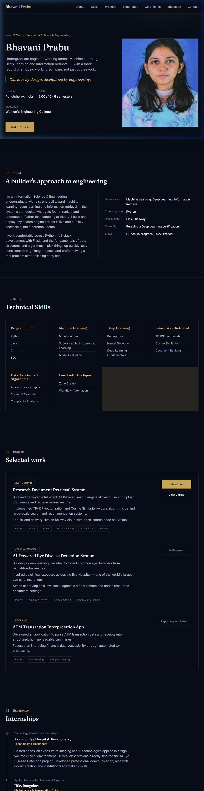

# Bhavani Prabu — Professional UI/UX & Engineering Portfolio

[](https://developer.mozilla.org/en-US/docs/Web/HTML)
[](https://developer.mozilla.org/en-US/docs/Web/CSS)
[](https://developer.mozilla.org/en-US/docs/Web/JavaScript)
[](LICENSE)

A modern, responsive single-page web application showcasing the engineering portfolio, research projects, technical skills, certifications, and experience of **Bhavani Prabu** (B.Tech Information Science & Engineering).

---

## 📖 Table of Contents

- [Overview](#-overview)
- [Key Features](#-key-features)
- [Screenshots](#-screenshots)
- [Project Structure](#-project-structure)
- [Source Code Highlights](#-source-code-highlights)
- [Setup & Run Instructions](#-setup--run-instructions)
- [Design System & Aesthetics](#-design-system--aesthetics)
- [Documentation & Customization](#-documentation--customization)
- [Author & Contact](#-author--contact)

---

## 🌟 Overview

This repository contains the source code for the personal developer portfolio of **Bhavani Prabu**, specializing in Machine Learning, Deep Learning, and Information Retrieval. Built with pure HTML5, modern vanilla CSS3, and lightweight JavaScript, it provides a high-performance, fast-loading, and visually rich portfolio experience without heavy framework dependencies.

---

## ✨ Key Features

- **Dark Mode Aesthetic**: Curated navy (`#070c17`) and warm gold (`#c6a75a`) color palette with sleek glassmorphism navigation.
- **Typography & Hierarchy**: Serif headers (`Fraunces`) paired with clean sans-serif body text (`Inter`).
- **Responsive Layout**: Fluid CSS Grid and Flexbox architecture adapting smoothly across desktop, tablet, and mobile displays.
- **Interactive Sections**:
  - **Hero Header**: Profile highlights, location, CGPA badge, and portrait showcase.
  - **About & Core Stack**: Personal engineering approach and focus areas.
  - **Technical Skills**: Categorized breakdown covering Programming, ML, DL, IR, DSA, and Low-Code development.
  - **Selected Projects**: Live deployment links, GitHub repository buttons, and status tags.
  - **Internships & Experience**: Timeline view of research and clinical internship experience (Aravind Eye Hospital, IISc Bangalore, MSME).
  - **Certifications**: Dynamic card grid rendered via JavaScript data models.
  - **Achievements**: Bulleted highlights of competition prizes, hackathons, and SIH representation.
  - **Contact Form**: Accessible UI form with email & phone quick links.

---

## 📸 Screenshots

### Portfolio Homepage Overview


---

## 📁 Project Structure

```
uiux/
├── bhavani-prabu-portfolio.html   # Main web application file (HTML5 + Inline CSS & JS)
├── screenshot.png                 # Preview screenshot of the portfolio interface
└── README.md                      # Comprehensive project documentation
```

---

## 💻 Source Code Highlights

### 1. CSS Custom Design Tokens (`:root`)
Centralized color palette and design variables for theme consistency across all components:

```css
:root {
  --navy-950: #070c17;
  --navy-900: #0c1526;
  --navy-800: #121f38;
  --hairline: rgba(198, 167, 90, 0.16);
  --gold: #c6a75a;
  --gold-bright: #e3c576;
  --ink: #eef1f6;
  --ink-dim: #a9b3c7;
  --ink-faint: #6f7a92;
  --maxw: 1120px;
}
```

### 2. Glassmorphism Navigation Bar
Fixed sticky header with background backdrop blur filter:

```css
header.site-nav {
  position: fixed; top: 0; left: 0; right: 0; z-index: 100;
  background: rgba(7, 12, 23, 0.86);
  backdrop-filter: blur(10px);
  border-bottom: 1px solid var(--hairline);
}
```

### 3. Dynamic Certificate Rendering (JavaScript)
Data-driven DOM rendering for certification slots:

```javascript
const certificates = [
  { title: "Design Thinking & Innovation", issuer: "NPTEL (IIT/NIT)", link: "" },
  { title: "User Centric Computing for Human Computer Interaction", issuer: "NPTEL (IIT/NIT)", link: "" },
  { title: "Zoho Creator Student Training Program (Low-Code)", issuer: "Zoho", link: "" }
];

const certGrid = document.getElementById('certGrid');
certificates.forEach((cert, i) => {
  const num = String(i + 1).padStart(2, '0');
  const card = document.createElement('div');
  card.className = 'cert-card';
  card.innerHTML = `
    <span class="cert-no">Certificate ${num}</span>
    <span class="cert-title">${cert.title}</span>
    <span class="cert-issuer">${cert.issuer}</span>
  `;
  certGrid.appendChild(card);
});
```

---

## 🚀 Setup & Run Instructions

Since this is a lightweight static web application, no build tools or package managers (such as Node/npm) are required to run it.

### Option 1: Direct Browser Launch
Simply double-click `bhavani-prabu-portfolio.html` or open it directly in any modern web browser (Chrome, Firefox, Edge, Safari).

### Option 2: Local HTTP Server (Recommended)

#### Using Python:
```bash
# Navigate to project root
cd uiux

# Start Python HTTP server
python -m http.server 8000
```
Open `http://localhost:8000/bhavani-prabu-portfolio.html` in your browser.

#### Using Node.js `npx`:
```bash
npx http-server -p 8000
```

---

## 🎨 Design System & Aesthetics

- **Color Harmony**: Deep midnight navy background contrast with warm metallic gold accents.
- **Typography**: Google Fonts integration (`Fraunces` serif for headers, `Inter` for clean readability).
- **Accessibility**: High contrast text ratios, explicit focus rings (`:focus-visible`), and semantic HTML5 tags (`<header>`, `<main>`, `<section>`, `<article>`, `<footer>`).
- **Responsive Layout**: Media queries tailored for desktop (>860px), tablet, and mobile screen sizes.

---

## 📄 Documentation & Customization

### Updating Profile Data
To update personal information, project links, or email addresses, edit the corresponding sections in `bhavani-prabu-portfolio.html`:

- **Hero & Meta Info**: Lines 372–397
- **Projects & URLs**: Lines 475–526
- **Contact Details**: Lines 628–636

### Adding New Certificates
In the `<script>` tag at the bottom of `bhavani-prabu-portfolio.html`, add new objects to the `certificates` array:

```javascript
{ 
  title: "Your New Certification", 
  issuer: "Issuing Organization", 
  link: "https://link-to-certificate.com" 
}
```

---

## 👤 Author & Contact

**Bhavani Prabu**  
*B.Tech in Information Science & Engineering*  
📍 Pondicherry, India  

- **Email**: [bhavani130905@gmail.com](mailto:bhavani130905@gmail.com)
- **GitHub**: [@bhavani130905](https://github.com/bhavani130905)
- **LinkedIn**: [bhavani-prabu](https://www.linkedin.com/in/bhavani-prabu-a31a732a7)
- **Live Search Engine Project**: [Railway App](https://web-production-aa438.up.railway.app)
